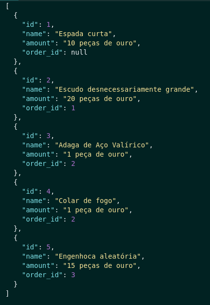
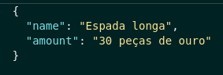
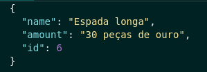
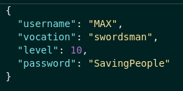
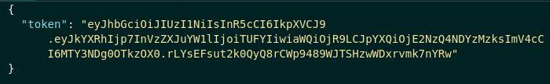
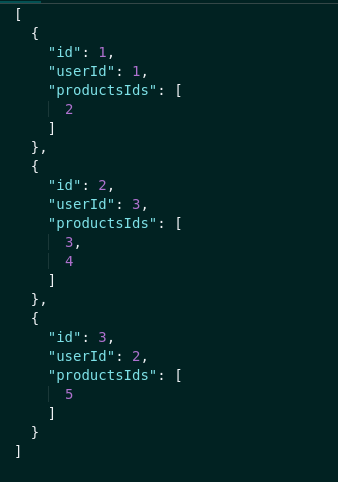
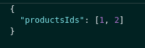
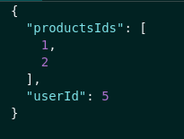
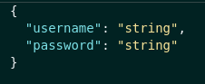

<h1>TrybeSmith</h1>

  TrybeSmith is a simple API built using NodeJS, Express, MySQL and TypeScript. MSC architecture (Models, Services, 
  Controllers) was applied in this project.
  
  The project was developed in a docker environment.

  The user is able to: 
  -  create and read orders;
  -  create and read products;
  -  create users;
  -  do log in;
 

<h2> Built With </h2>

 
 - NodeJS 

 
 - Express 

 
 - MySQL 

 
 - Docker 
 
 
 - TypeScript 

 
 - Conventional commits (extension) 

<h2>Endpoints</h2>

<h3> Products: </h3>

<h3> - GET  </h3>
 
<strong> /products </strong>

 Get all products 

<strong> Parameters: No parameters </strong>   

<strong> Response: </strong>

 Status: 200 

 

<h3> - POST  </h3>

<strong> /products </strong>

 Create a new product 

<strong> Parameters:</strong>

 -body 

<strong> Response: </strong>

 Status: 201 

 Status: 400 

 - { message: "name is required" } 

 - { message: "amount is required" } 

 Status: 422 

 - { message: "name length must be at least 3 characters long" } 

 - { message: "amount length must be at least 3 characters long" } 

 - { message: "name must be a string" } 

 - { message: "amount must be a string" } 

 
 
 

<h3> User: </h3>

<h3> - POST  </h3>
 
<strong> /users </strong>

 Create User 

<strong> Parameters:</strong>

 -body 

<strong> Response: </strong>

 Status: 200 

 Status: 400 

 - { message: "username is required" } 

 - { message: "vocation is required" } 

 - { message: "password is required" } 

 - { message: "level is required" } 

 Status: 422 

 - { message: "username length must be at least 3 characters long" } 

 - { message: "vocation length must be at least 3 characters long" } 

 - { message: "password length must be at least 8 characters long" } 

 - { message: "level must be greater than or equal to 1" } 

 - { message: "username must be a string" } 

 - { message: "vocation must be a string" } 

 - { message: "password must be a string" } 

 - { message: "level must be a number" } 

 
 
 

<h3> Orders: </h3>

<h3> - GET  </h3>
 
<strong> /orders </strong>

 Get all orders 

<strong> Parameters: No parameters </strong>   

<strong> Response: </strong>

 Status: 200 

 

<h3> - POST  </h3>

<strong> /orders </strong>

 Create new order 

<strong> Parameters:</strong>

 -body 

 

 -headers 

 Authorization: token 
 

<strong> Response: </strong>

 Status: 201 

 Status: 401 

 - { message: "Token not found" } 

 - { message: "Invalid token" } 

 Status: 400 

 - { message: "productsIds is required" } 

 Status: 422 

 - { message: "productsIds must be an array" } 

 - { message: "productsIds must include only numbers" } 

 
 
 

<h3> Login: </h3>

<h3> - POST  </h3>
 
<strong> /login </strong>

 Do log in 

<strong> Parameters:</strong>

 -body 

<strong> Response: </strong>

 Status: 200 

 Status: 400 

 - { message: "username is required" } 

 - { message: "password is required" } 

 Status: 401 

 - { message: "Username or password invalid" } 

 
 
 

<h2>
  How try the application?
</h2>

  Using docker (version 1.29 > is required):   
   1. First run in your terminal <code>docker-compose up -d</code> to up containers.  
   2. Then use the command <code>docker exec -it trybesmith bash</code> to acess the container terminal.  
   3. After it use  <code>npm install</code> to install all dependences.  
   4. Run <code>npm run createDb</code> on container terminal to create and populate database. 
   5. Run <code>npm start</code> on container terminal to start the application. 
   6. If you don´t have any client extension to do the requestions download <code>Thunder Client</code> extension on VS Code. 
   7. Select the method on thunder client. 
   8. Do requisitions on thunder client using the URL shape http://localhost:3000/endpoint.

  Make sure that all containers are up and the ports 3000, 3006 and 33060 of your computer are available

 
 
  

 Any questions or suggestions? Contact me 

